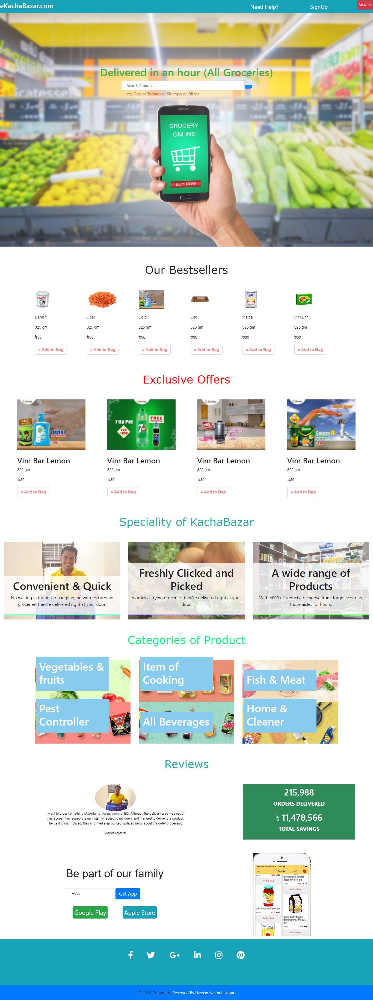

#### 1.Introduction:
  This is an ongoing E-commerce online shopping site. Through this site user will able to use it for online shopping. Bootstrap, JQuery, Javascript are used for the front-end design.In backend PHP, MySQL are use for data passing. i am working on the backend to complete this project. In the future, i will add more feature and some special changes. 

#### 2.1: Purpose
      i)Global market reach
      ii)A global choice for consumers
      iii)Short product/service distribution chain
      iv)Lesser costs and pricing
      
#### 2.2: Guidence and reference
      Amazon,
      eBay,
      Chaldal,
      Alibaba,
      Walmart

#### 2.3 User Interface:-
 
  

#### (2.2) Use of Technology and Language:

      * MVC framework (Laravel)
      * PHP
      * JavaScript
      * JQuery
      * MySQL Database
      * Xampp Local server
      * Bootstrap 4
      * HTML, CSS
