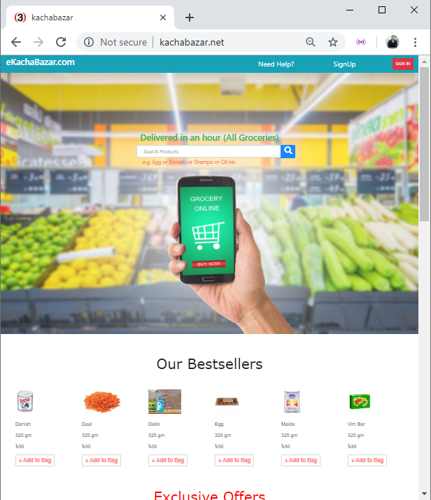
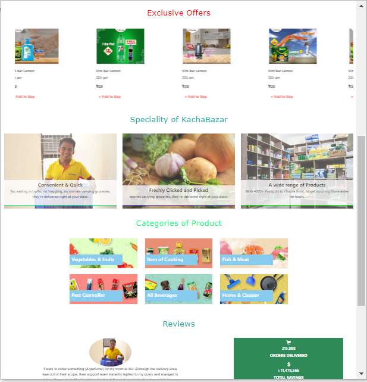
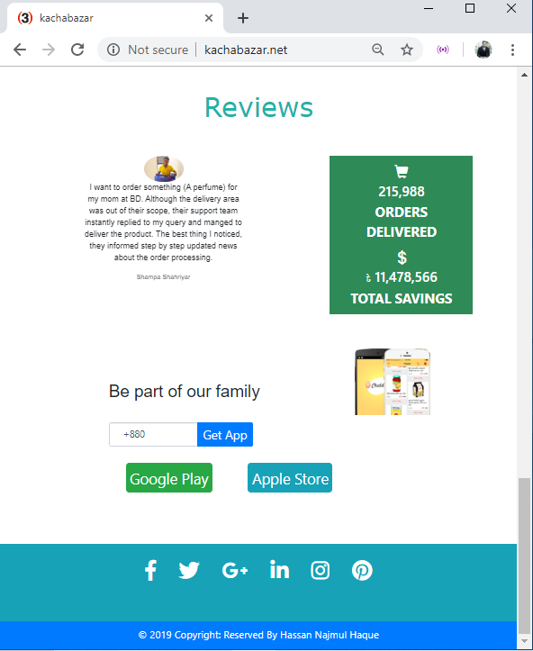

#### Project title: eKachabazar.com 

1.Introduction:
  This is an underconstruction E-commerce online shopping site. Through this site We could easily buy our regular groceries. To make an attract front-end design, i used Bootstrap, JQuery, Javascript etc. i already working to complete this project. In the future, i will add more feature and some special changes. 

2.1: Purpose of the site:
  i)Global market reach
  ii)A global choice for consumers
  iii)Short product/service distribution chain
  iv)Lesser costs and pricing

2.2: Guidence and reference: 
  These are some of the most popular e-commerce websites across the world that i get some help –
  Amazon,
  eBay,
  Chaldal,
  Alibaba,
  Walmart

2.3 User Interface:-
 
   

   
  
   
